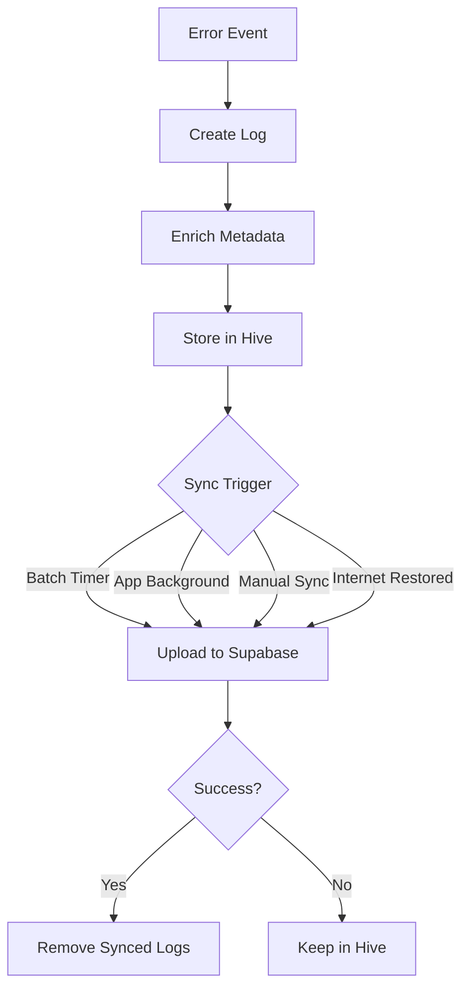

# Supabase Network Logger 🚀

A private Flutter package for automated, resilient, and batched logging of network failures, validation errors, and app exceptions directly to a Supabase database.

> **Version 2.0.0**
>
> This version introduces the new `global_api_logs` schema with enhanced metadata support including user tracking, tagging, and richer request/response payload storage.

---

## 🛡️ Reliability & Offline Support

* **Local First**: Every log is saved instantly to **Hive (Local Storage)** before any network attempt.
* **Background Sync**: Automatically attempts a final sync when the app is minimized or backgrounded.
* **Persistence**: Logs survive app restarts, crashes, and internet outages.
* **Circuit Breaker**: Prevents excessive retries when Supabase is unavailable.
* **Batched Uploads**: Logs are uploaded in batches to reduce battery and network usage.

---

## ✨ Features

* Automated Dio API error logging.
* Offline-first architecture using Hive.
* Automatic device and app metadata collection.
* Automatic screen tracking.
* Crash and exception logging.
* Business validation failure logging.
* User-level tracking (`user_id`, `mobile`).
* Log categorization using tags.
* Multi-tenant support through global metadata.

---

## 📊 Architecture



---

## 🛠 Step 1: Supabase Backend Setup

Run the following SQL in your Supabase project.

```sql
create table public.global_api_logs (
  id uuid not null,
  created_at timestamp with time zone not null default timezone ('utc'::text, now()),
  error_type text not null,

  url text null,
  method text null,
  status_code integer null,

  request_data jsonb null,
  api_response_data jsonb null,

  error_message text null,
  stack_trace text null,
  trace_id text null,

  device_info jsonb null,
  app_version jsonb null,

  screen_name text null,
  extra jsonb null,

  tag text null,
  user_id text null,
  mobile text null,

  constraint global_api_logs_pkey primary key (id)
);
```

Enable Row Level Security:

```sql
alter table public.global_api_logs
enable row level security;
```

Create insert policy:

```sql
create policy "Allow anonymous upsert"
on public.global_api_logs
for all
to anon
using (true)
with check (true);
```

---

## 📦 Step 2: Add Dependency

Use the feature branch until it is merged into main:

```yaml
dependencies:
  supabase_network_logger:
    git:
      url: https://github.com/hrshere/supabase_network_logger.git
      ref: global-api-logs
```

---

## 🚀 Step 3: Initialize Logger

Initialize the logger before running the app.

```dart
void main() async {
  WidgetsFlutterBinding.ensureInitialized();

  await SupabaseNetworkLogger.init(
    appName: 'My-App-Name',
    supabaseUrl: 'https://your-project.supabase.co',
    supabaseAnonKey: 'your-anon-key',
    screenProvider: () => Get.currentRoute,
    globalExtra: {
      'flavor': 'eros',
      'environment': 'UAT',
    },
  );

  runApp(MyApp());
}
```

---

## 🌍 Global Metadata

Global metadata is automatically merged into every log entry.

```dart
await SupabaseNetworkLogger.init(
  ...
  globalExtra: {
    'client': 'eros',
    'environment': 'production',
    'region': 'india',
  },
);
```

Stored inside the `extra` column.

---

## 📡 Automatic API Logging

```dart
final dio = Dio();

dio.interceptors.add(
  SupabaseLoggerInterceptor(),
);
```

Automatically captures:

* URL
* Method
* Status Code
* Request Payload
* Response Payload
* Exception Details

Sensitive fields such as:

```text
password
token
authorization
secret
fcm_token
```

are masked automatically.

---

## 📍 Screen Tracking

Add the observer to your app.

```dart
GetMaterialApp(
  navigatorObservers: [
    SupabaseLoggerObserver(),
  ],
);
```

The current screen name is stored in:

```text
screen_name
```

---

## 🧯 Global Crash Handling

Capture Flutter framework crashes.

```dart
FlutterError.onError = (details) {
  SupabaseNetworkLogger.logFailure(
    type: 'FLUTTER_ERROR',
    errorMessage: details.exceptionAsString(),
    stackTrace: details.stack.toString(),
  );

  FlutterError.presentError(details);
};
```

Capture asynchronous exceptions.

```dart
PlatformDispatcher.instance.onError = (error, stack) {
  SupabaseNetworkLogger.logFailure(
    type: 'ASYNC_ERROR',
    errorMessage: error.toString(),
    stackTrace: stack.toString(),
  );

  return true;
};
```

---

## ✍️ Manual Logging

```dart
try {
  // business logic
} catch (e, stack) {
  SupabaseNetworkLogger.logFailure(
    type: 'APP_EXCEPTION',
    errorMessage: e.toString(),
    stackTrace: stack.toString(),
  );
}
```

---

## 🏷️ Tagged Logging

Use tags to categorize failures.

```dart
SupabaseNetworkLogger.logFailure(
  type: 'VALIDATION_FAILURE',
  tag: 'CHECKIN_GEOFENCE',
  errorMessage: 'User outside allowed radius',
);
```

Examples:

* LOGIN
* CHECKIN
* GEO_FENCE
* PAYMENT
* ATTENDANCE

---

## 👤 User Context Logging

Attach user information to logs.

```dart
SupabaseNetworkLogger.logFailure(
  type: 'API_FAILURE',
  userId: '12345',
  mobile: '9999999999',
);
```

Stored in:

* `user_id`
* `mobile`

---

## 📊 Database Schema

Each log contains:

| Column            | Description           |
| ----------------- | --------------------- |
| id                | Unique log identifier |
| created_at        | UTC timestamp         |
| error_type        | Failure category      |
| url               | Request URL           |
| method            | HTTP method           |
| status_code       | Response status       |
| request_data      | Request payload       |
| api_response_data | Response payload      |
| error_message     | Error details         |
| stack_trace       | Stack trace           |
| trace_id          | Correlation ID        |
| device_info       | Device metadata       |
| app_version       | App metadata          |
| screen_name       | Current screen        |
| tag               | Log category          |
| user_id           | User identifier       |
| mobile            | Mobile number         |
| extra             | Custom metadata       |

---

## 📊 Viewing Logs

1. Open Supabase Dashboard.
2. Navigate to **Table Editor**.
3. Select **global_api_logs**.
4. Filter by:

    * error_type
    * tag
    * user_id
    * mobile
    * environment
    * client

You now have complete visibility into application failures, validation issues, crashes, and API health.
