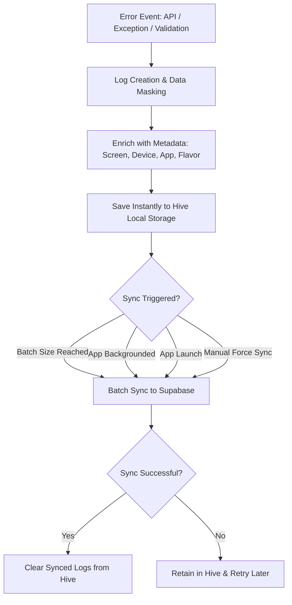

# Supabase Network Logger 🚀

A private Flutter package for automated, resilient, and batched logging of network failures, validation errors, and app exceptions directly to a Supabase database.

## 🛡️ Reliability & Offline Support

- **Local First**: Every log is saved instantly to **Hive (Local Storage)** before any network attempt.
- **Background Sync**: The logger automatically detects when the app is minimized (backgrounded) and attempts a "last gasp" sync to flush all pending logs.
- **Persistence**: If the app is killed or the device loses internet, logs remain in Hive and will be automatically synced as soon as the app is reopened and a connection is available.
- **Circuit Breaker**: Prevents excessive sync attempts if Supabase is down, preserving battery and bandwidth.

## ✨ Features

- **Automated API Logging**: Integrated with `Dio` to catch 4xx, 5xx, and timeout errors automatically.
- **Offline Resilience**: Uses `Hive` for local storage; logs are saved even when the device is offline.
- **Smart Syncing**: Batches logs every 30 seconds to save battery and reduce network calls.
- **Circuit Breaker**: Automatically stops syncing if Supabase is unreachable to prevent battery drain.
- **Rich Metadata**: Automatically captures Device Model, OS Version, App Version, Build Number, and Package Name.
- **Business Rule Tracking**: Manual logging for validation failures (e.g., geofencing, form errors).

---

## 📊 Architecture Flowchart



---

## 🛠 Step 1: Supabase Backend Setup (One-Time)

Run the following script in your Supabase **SQL Editor** to create the table and security policies:

```sql
-- 1. Create the table
create table public.network_logs (
  id uuid primary key,
  created_at timestamp with time zone default timezone('utc'::text, now()) not null,
  error_type text not null, -- 'API_FAILURE', 'INTERNET_FAILURE', 'VALIDATION_FAILURE'
  url text,
  method text,
  status_code int,
  request_body jsonb,
  response_body jsonb,
  error_message text,
  stack_trace text,
  trace_id text,
  device_info jsonb,
  app_info jsonb,
  screen_name text,
  extra jsonb
);

-- 2. Enable Security
alter table public.network_logs enable row level security;

-- 3. Allow anonymous UPSERT (Insert + Update)
create policy "Allow anonymous upsert" 
on public.network_logs 
for all 
to anon 
using (true) 
with check (true);
```

---

## 📦 Step 2: Add Dependency

Add the package to your `pubspec.yaml`:

```yaml
dependencies:
  supabase_network_logger:
    path: ../packages/supabase_network_logger # Adjust path as needed
```

---

## 🚀 Step 3: App Integration

### 1. Initialize in `main.dart`
Initialize the logger at the very start of your `main()` function.

```dart
void main() async {
  WidgetsFlutterBinding.ensureInitialized();
  
  await SupabaseNetworkLogger.init(
    appName: 'My-App-Name',
    supabaseUrl: 'https://your-project.supabase.co',
    supabaseAnonKey: 'your-anon-key',
    screenProvider: () => Get.currentRoute,
    // Optional: Add global metadata for every log (e.g. Multi-tenancy)
    globalExtra: {
      'flavor': 'eros',
      'environment': 'UAT',
    },
  );
  
  runApp(MyApp());
}
```

### Multi-Tenancy Support
The `globalExtra` map is perfect for tracking multiple clients using the same codebase. Any data added here will be merged into the `extra` field in Supabase for every log entry. This allows you to filter logs by client or environment easily.

### 2. Add Dio Interceptor
Add the interceptor to your `Dio` instance to start catching API failures automatically.

```dart
final dio = Dio();
dio.interceptors.add(SupabaseLoggerInterceptor());
```

### 3. Add Screen Tracking (Optional but Recommended)
Add the `SupabaseLoggerObserver` to your `MaterialApp` to automatically populate the `screen_name` field in your logs.

```dart
GetMaterialApp( // or MaterialApp
  navigatorObservers: [
    SupabaseLoggerObserver(), // 👈 Tracks current screen automatically
  ],
  ...
)
```

### 4. Setup Global Safety Net (Optional but Recommended)
Catch all uncaught app crashes and async errors automatically by adding these lines to your `main()`:

```dart
void main() async {
  // ... init code ...

  // Catch Flutter framework errors
  FlutterError.onError = (details) {
    SupabaseNetworkLogger.logFailure(
      type: 'FLUTTER_ERROR',
      errorMessage: details.exceptionAsString(),
      stackTrace: details.stack.toString(),
    );
    FlutterError.presentError(details);
  };

  // Catch Async errors
  PlatformDispatcher.instance.onError = (error, stack) {
    SupabaseNetworkLogger.logFailure(
      type: 'ASYNC_ERROR',
      errorMessage: error.toString(),
      stackTrace: stack.toString(),
    );
    return true;
  };

  runApp(MyApp());
}
```

### 5. Manual Error Hook
To catch specific validation errors or business rule failures:

```dart
try {
  // Your code...
} catch (e, stack) {
  SupabaseNetworkLogger.logFailure(
    type: 'APP_EXCEPTION',
    errorMessage: e.toString(),
    stackTrace: stack.toString(),
  );
}
```

---

## 📊 Viewing Logs

1. Go to your **Supabase Dashboard**.
2. Click on **Table Editor** ▦.
3. Select the **`network_logs`** table.
4. Profit! You now have full visibility into your app's health.
